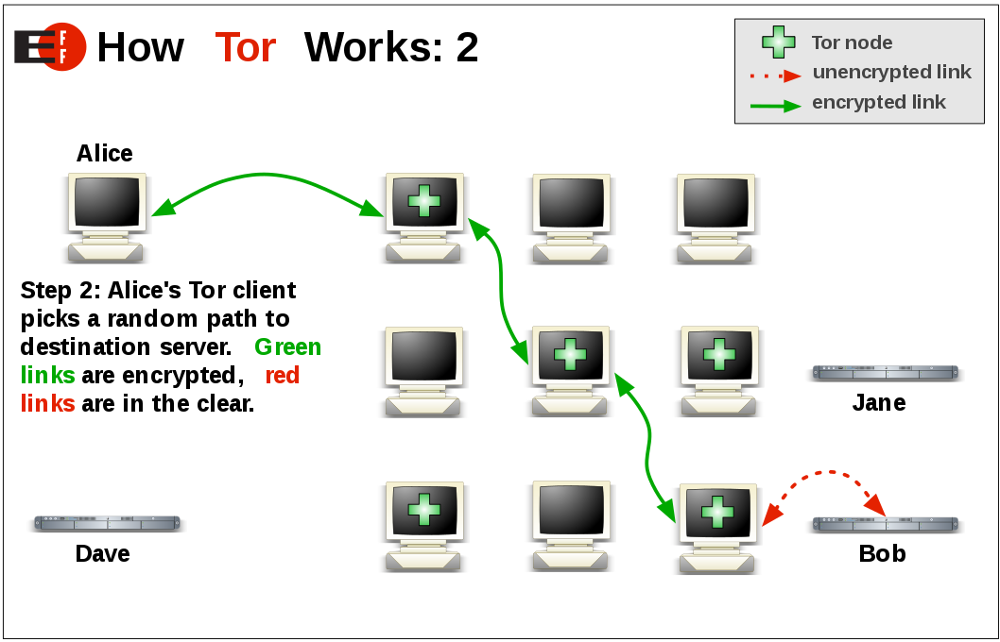
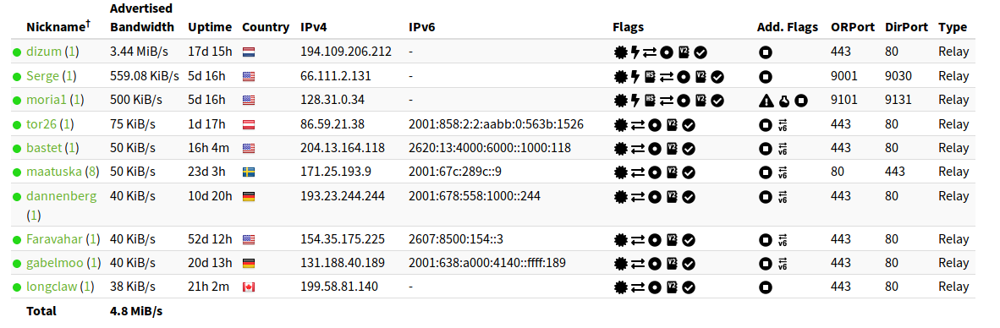
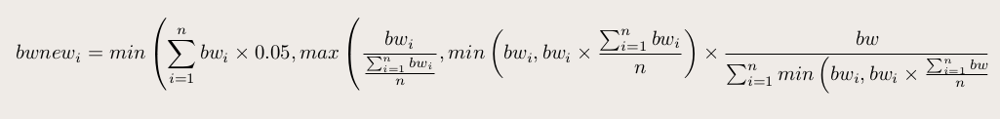
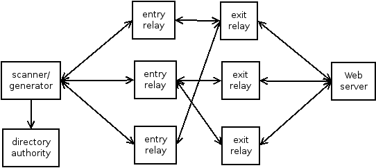
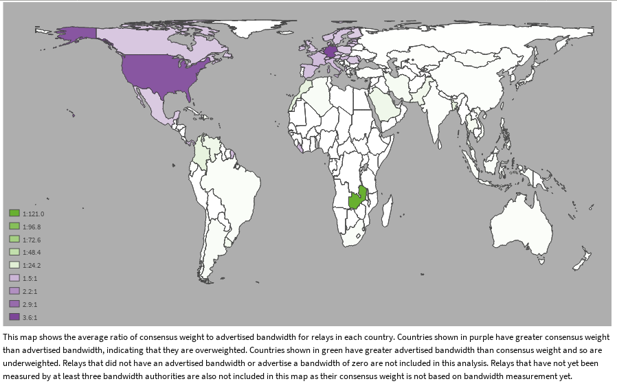
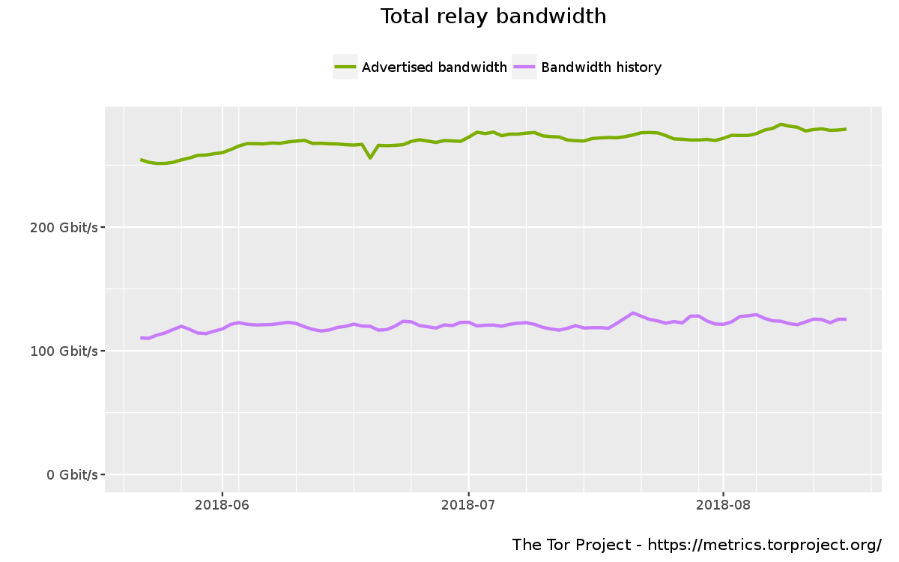
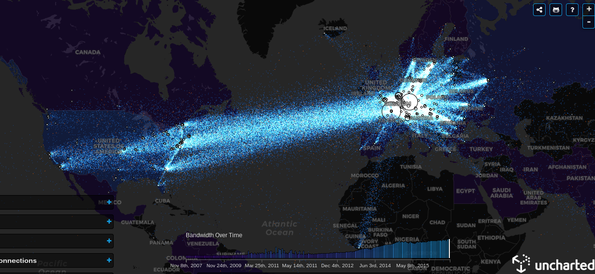

Onion Bandwidth Scanner
=========================

OnBaSca ⚖🌏 (https://onbasca.readthedocs.io )

*aka* how to get  relays' bandwidth 

[juga at riseup dot net](juga at riseup dot net)

Bornhack, Bornholm, August 2018

----  ----

Contents
========

* Brief introduction to Tor
* Bandwidth values in Tor
* Bandwidth scanners/generators
  * `Torflow`
  * `bwscanner`
  * `sbws`
* Future work
* Open questions

----  ----

Brief introduction to Tor
==========================

----



----

Directory Authorities
-----------------------



https://metrics.torproject.org/rs.html#search/flag:Authority

----

Consensus documents
--------------------


----

Why is needed to have a consensus documents?
--------------------------------------------

all relays need to have the same view of the network

----

How is consensus created
--------------------------

1. relays publish descriptors to a directory authority (dirauth)
1. dirauths exchange descriptors with each other
1. the dirauths that have measurements from a bandwidth scanner (4/10):
   1. read those measurements
   1. calculate bandwidth weights
   1. create vote documents including the `measured` bandwidth and consensus weight
1. dirauths exchange votes 
1. dirauths create consensus documents
1. dirauths publish consensus documents

----

Why is needed to have relays' bandwidth measurements (aka scanners)?
---------------------------------------------------------------------

* to distribute the network load according to relay capacity
* relays self-advertise their bandwidths, but a malicious relay could 
  self-advertise more bandwidth in order to get more circuits to it.
  Having more circuits makes easier some attacks (source routed)

----

What a better bandwidth scanner could improve
----------------------------------------------  

* distribute the network load smarter making Tor network faster and more fair
* increase the diversity of the relays (currently most of the bandwidth is in Germany)
* encourage relay operators to increase the capacity of their relays 

----  ----

Bandwidth values
================

- relays' bandwidth configuration (operators)
- relays' self-measured bandwidth (descriptors)
- measured bandwidths (scanners)
- consensus weights (dirauths)

----

Bandwidth values configured by relays' operators
-------------------------------------------------

`/etc/tor/torrc`

* BandwidthRate
* BandwidthBurst
* MaxAdvertisedBandwidth
* RelayBandwidthRate
* RelayBandwidthBurst
* PerConnBWRate
* PerConnBWBurst

[* tor.1.txt *](https://gitweb.torproject.org/tor.git/tree/doc/tor.1.txt#n222)<!-- .element:  class="cite" -->

----

Bandwidth in values in relays' descriptor
------------------------------------------

* average bandwidth (advertised bandwidth?) (not any measurements)
* burst bandwidth
* observed bandwidth

```text  
 "bandwidth" bandwidth-avg bandwidth-burst bandwidth-observed NL
 ```

[* dir-spec.txt *](https://gitweb.torproject.org/torspec.git/tree/dir-spec.txt#n427)<!-- .element:  class="cite" -->

----

Descriptor example
--------------------

```text
@downloaded-at 2018-03-26 07:05:10
@source "86.59.21.38"
router sonsorolDotNet 50.247.195.124 9001 0 9030
identity-ed25519
-----BEGIN ED25519 CERT-----
AQQABnPkARHcXgsN0T0t2BXquO7Bc5E2ZgtxlGD3mGaJIyct3wITAQAgBAAx8gv4
geoonl/0flvSzrNoBTE0O9/ZhqDHhaGXFqkH++Yg3b9CUG33sPYc7a66sc8UBK87
Br9/7HR/67fyCyOqngcxNdBxFf1fKLImej/kLvWuHXpA1dcgZdB5uPZ9dQM=
-----END ED25519 CERT-----
master-key-ed25519 MfIL+IHqKJ5f9H5b0s6zaAUxNDvf2Yagx4WhlxapB/s
platform Tor 0.3.3.3-alpha on Linux
proto Cons=1-2 Desc=1-2 DirCache=1-2 HSDir=1-2 HSIntro=3-4 HSRend=1-2 Link=1-5 LinkAuth=1,3 Microdesc=1-2 Relay=1-2
published 2018-03-26 06:48:42
fingerprint 3DE5 67C1 350C 0E85 8C61 47AE CB06 EA9B 3EAF 3261
uptime 1944246
bandwidth 819200 1638400 1693124
extra-info-digest D717F6C073391E11FFE81CF8A08E650788286842 CcKt5jLKC7bikmAtX59GN/xKmANKCXwGEi3KGW2FVEI
onion-key
-----BEGIN RSA PUBLIC KEY-----
```

```text
/var/lib/tor/cached-descriptors
```

----

Bandwidth values in consensus documents
------------------------------------------

```text
"w" SP "Bandwidth=" INT [SP "Measured=" INT] [SP "Unmeasured=1"] NL
```

[* dir-spec.txt *](https://gitweb.torproject.org/torspec.git/tree/dir-spec.txt#n2337)<!-- .element:  class="cite" -->

```text
Bandwidth = min(observed bandwidth, descriptor bandwidth rate limit, 10MB/s) 
KB/s
Measured = consensus bandwidth * ratio(avg stream, "network avg"?)
```

If 3 or more authorities provide a Measured= keyword for
a router, the authorities produce a consensus containing a "w"
Bandwidth= keyword equal to the median of the Measured= votes.

----

Example consensus document
---------------------------

```text
r CalyxInstitute14 ABG9JIWtRdmE7EFZyI/AZuXjMA4 fXwv8Ev8WzKw04I6y7k+7EqMUuU 2018-03-25 16:13:41 162.247.72.201 443 80
s Exit Fast HSDir Running Stable V2Dir Valid
v Tor 0.3.2.10
pr Cons=1-2 Desc=1-2 DirCache=1-2 HSDir=1-2 HSIntro=3-4 HSRend=1-2 Link=1-5 LinkAuth=1,3 Microdesc=1-2 Relay=1-2
w Bandwidth=6630
p accept 20-23,43,53,79-81,88,110,143,194,220,389,443,464,531,543-544,554,563,636,706,749,873,902-904,981,989-995,1194,1220,1293,1500,1533,1677,1723,1755,1863,2082-2083,2086-2087,2095-2096,2102-2104,3128,3389,3690,4321,4643,5050,5190,5222-5223,5228,5900,6660-6669,6679,6697,8000,8008,8074,8080,8087-8088,8332-8333,8443,8888,9418,9999-10000,11371,12350,19294,19638,23456,33033,64738
```

----

```text
r UbuntuCore212 TVya35Vd7ACGa7841ERSlX8PJKw byKPgLBokqHYUiHvIcIxbUK4qTc 2018-03-26 02:48:01 24.197.119.19 41935 0
s Running V2Dir Valid
v Tor 0.3.1.10
pr Cons=1-2 Desc=1-2 DirCache=1-2 HSDir=1-2 HSIntro=3-4 HSRend=1-2 Link=1-5 LinkAuth=1,3 Microdesc=1-2 Relay=1-2
w Bandwidth=0 Unmeasured=1
p reject 1-65535
```

----  ----

Bandwidth scanners/generators
===============================

----

Torflow
---------

- by Mike Perry and others
- 2010?
- use [TorCtl](https://gitweb.torproject.org/pytorctl.git/), Python 2
- difficult to install and manintain

https://gitweb.torproject.org/torflow.git

https://research.torproject.org/techreports/torflow-2009-08-07.pdf

----

How Torflow performs measurements
----------------------------------

* split relays into buckets by bandwidth percentile
* build two hop circuits with a relay and exit from relays in the bucket
* download a file from a Web server. The file size is based on the bucket
* measure how long it takes
* store the results

----

How Torflow aggregates measurements
-----------------------------------

* hourly
* calculate a bandwidth weight based on the descriptor average bandwidth (advertised bandwidth ratio?)
* generate a "measurements" file

----

How Torflow aggregates measurements
-----------------------------------



----

Torflow Bandwidth measurements file
------------------------------------

`aka` `Bandwidth list v1.0.0` 

```text
1523911758
node_id=$68A483E05A2ABDCA6DA5A3EF8DB5177638A27F80 bw=760 nick=Test measured_at=1523911725 updated_at=1523911725 pid_error=4.11374090719 pid_error_sum=4.11374090719 pid_bw=57136645 pid_delta=2.12168374577 circ_fail=0.2 scanner=/filepath
node_id=$96C15995F30895689291F455587BD94CA427B6FC bw=189 nick=Test2 measured_at=1523911623 updated_at=1523911623 pid_error=3.96703337994 pid_error_sum=3.96703337994 pid_bw=47422125 pid_delta=2.65469736988 circ_fail=0.0 scanner=/filepath
```

----

bwscanner
---------

- by Aaron Gibson and others
- 2016
- use [twisted](https://twistedmatrix.com/) and [txtorcon](https://github.com/meejah/txtorcon)
- not production ready, currently unmaintained

https://github.com/TheTorProject/bwscanner

----

Simple bandwidth scanner (sbws)
-------------------------------

- by Matt Traudt and juga
- 2018
- use threads
- use [stem](https://gitweb.torproject.org/stem.git/), Python 3
- being actively developed

https://gitweb.torproject.org/sbws.git

----

Initial sbws design
---------------------

exit relays were `helper relays`: 
relays with high bandwidth that would allow to exit only to
the Web server

* who should own these exits?
* extra infrastructure 

----

Which relays are measured first
--------------------------------

* sbws prioritizes relays to be measured
  * new relays
  * relays not measured recently

----

How sbws perform measurements
------------------------------

* build two hop circuits with the relay to measure and a random exit
  that has similar advertised bandwidth as the relay to measure
* download a file from a Web server
* the file size is adjusted depending on whether it takes more or less time 
  to download the file
* measure how long it takes
* store the results

----

How sbws perform measurements
------------------------------



----

sbws raw measurements compared to Torflow measurements
--------------------------------------------------------


----


----

How sbws aggregate the results
-------------------------------

* scaling
* imitate Torflow scaling

----

sbws scaling
-------------

Multiply each relay bandwidth by `7500/median`


----

sbws imitating Torflow
----------------------

Multiply each relay descriptor bandwidth by an small number


----

Dirauths' operating system distributions
-----------------------------------------

 
 

----

sbws system packages
---------------------

- Debian package (https://salsa.debian.org/pkg-privacy-team/sbws/)
  - waiting Debian ftp master to approve it
  - waiting for new `stem` release and package update
- OpenBSD Makefile (https://github.com/juga0/sbws_openbsd)

----  ----

Bandwidth list format specification
=====================================

v1.1.0 example

```text
1523911758
version=1.1.0
software=sbws
software_version=0.1.0
latest_bandwidth=2018-04-16T20:49:18
file_created=2018-04-16T21:49:18
generator_started=2018-04-16T15:13:25
earliest_bandwidth=2018-04-16T15:13:26
====
bw=380 error_circ=0 error_misc=0 error_stream=1 master_key_ed25519=YaqV4vbvPYKucElk297eVdNArDz9HtIwUoIeo0+cVIpQ nick=Test node_id=$68A483E05A2ABDCA6DA5A3EF8DB5177638A27F80 rtt=380 success=1 time=2018-05-08T16:13:26
bw=189 error_circ=0 error_misc=0 error_stream=0 master_key_ed25519=a6a+dZadrQBtfSbmQkP7j2ardCmLnm5NJ4ZzkvDxbo0I nick=Test2 node_id=$96C15995F30895689291F455587BD94CA427B6FC rtt=378 success=1 time=2018-05-08T16:13:36
```

https://gitweb.torproject.org/torspec.git/tree/bandwidth-file-spec.txt

----  ----

Possible attacks
================

Your ideas! =)

----  ----


How to measure improvements
=============================

----

Map consensus weight to bandwidth
----------------------------------



https://metrics.torproject.org/rs.html#map_consensus_weight_to_bandwidth

----

Bandwidth statistics
---------------------



https://metrics.torproject.org/bandwidth.html

----

Map Bandwidth
--------------



https://torflow.uncharted.software/#/2016-1-13?ML=-42,40,3

----

Other ideas
------------

* Firefox extension that tells current circuit bandwidth?
* Firefox extension that tells current measured capacity in the network?

----  ----


Future work
============

* Web servers in CDN
* find out why fast relays don't get high consensus weight
* find out why there're over-weighted relays
* better relation between bandwidth/consensus weight

----  ----

Open questions
==============

* do we want relays under our control to use for the measurements?
* algorithm to choose exits?
* location of the scanners?
* location of the Web servers?
* how to increase network diversity?

----

* how to distribute better network load around the world?
* what balance do we want between optimizing performance and maintaining network security?
* "proof of storage" protocol, which delegates the bandwidth measurements to little relays, which run in aggregate to measure bigger relays
* peerflow

----  ----


Contact
==========


juga at riseup dot net

2DA8 1D01 455C 3A00 3219  8850 F305 447A F806 D46B

IRC: #tor-dev at irc.freenode.org:6697

----  ----
